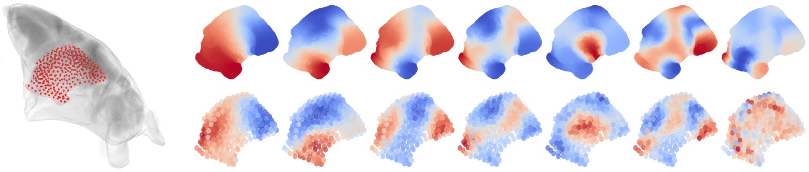

# Function aligns with geometry in locally connected networks



This repository contains the code and notebooks used in the manuscript:

 
> Antoine Légaré, Antoine Allard, Olivier Ribordy, Paul De Koninck, Patrick Desrosiers (2025). *Function aligns with geometry in locally connected neuronal networks.* Preprint available on [bioRxiv](https://www.biorxiv.org/content/10.1101/2025.08.08.669348v1)


## Overview

Analyses from the paper are conducted in multiple Jupyter notebooks found in the `Notebooks/` folder and generally split into 2 categories: some that compute results for specific figures of the paper (`FigureX-Analysis` notebooks), and some that take these results to generate vectorized figures (`FigureX-Layout` notebooks) for subsequent modifications using external software. All notebooks import functions in local `.py` files within the repository, and supplementary analyses are conducted in `Supp-` notebooks. Some analyses were computed externally on Compute Canada clusters, and the code can be accessed in the `ComputeCanada` folder. The processed data required to replicate the analyses can be downloaded here, while the raw calcium imaging data can be made available upon reasonable request.

## Installation


Clone the repository, then run the notebooks in a Python environment equipped with the appropriate packages, which can all be pip installed easily. Some notebooks will load files in a `Files/` folder, and write files in a `Results/` or `Figures/` folder, all of which should be manually created and placed in the main folder of the repository, next to the `Notebooks` folder.

## Citation

If you use this repository for your own work, please cite the paper:

> Antoine Légaré, Antoine Allard, Olivier Ribordy, Paul De Koninck, Patrick Desrosiers (2025). *Function aligns with geometry in locally connected neuronal networks.* [DOI: 10.1101/2025.08.08.669348](https://doi.org/10.1101/2025.08.08.669348)

BibTeX:
```bibtex
@article{legare2025function,
  title = {Function aligns with geometry in locally connected neuronal networks},
  author = {L{\'e}gar{\'e}, Antoine and Ribordy, Olivier and De Koninck, Paul and Allard, Antoine and Desrosiers, Patrick},
  journal = {bioRxiv},
  year = {2025},
  doi = {10.1101/2025.08.08.669348}
}
```

## Authors

- Antoine Légaré (antoine.legare.1@ulaval.ca)

For any questions regarding the repository, please contact us!
